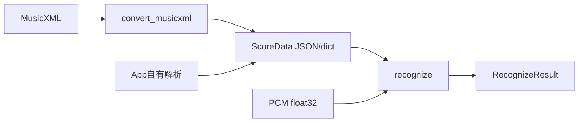
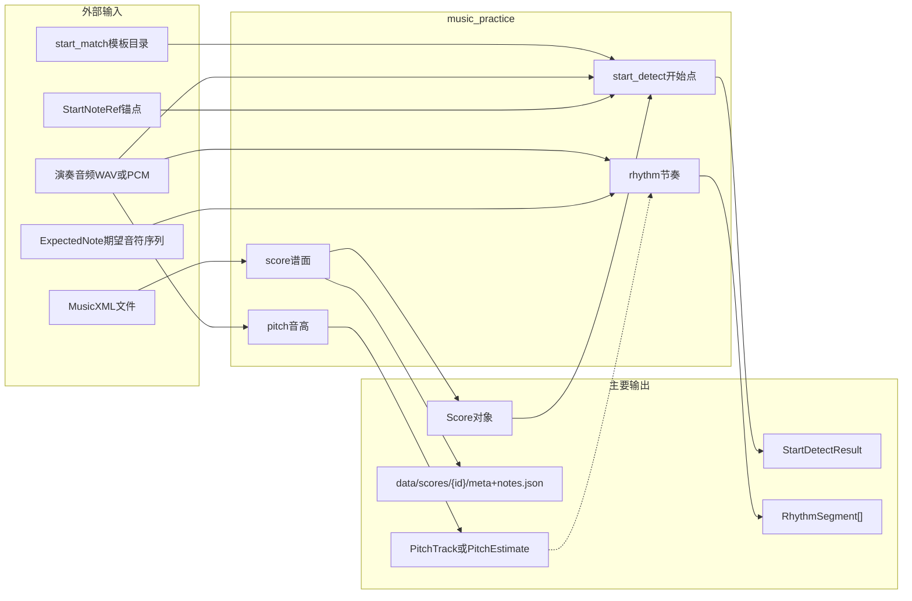
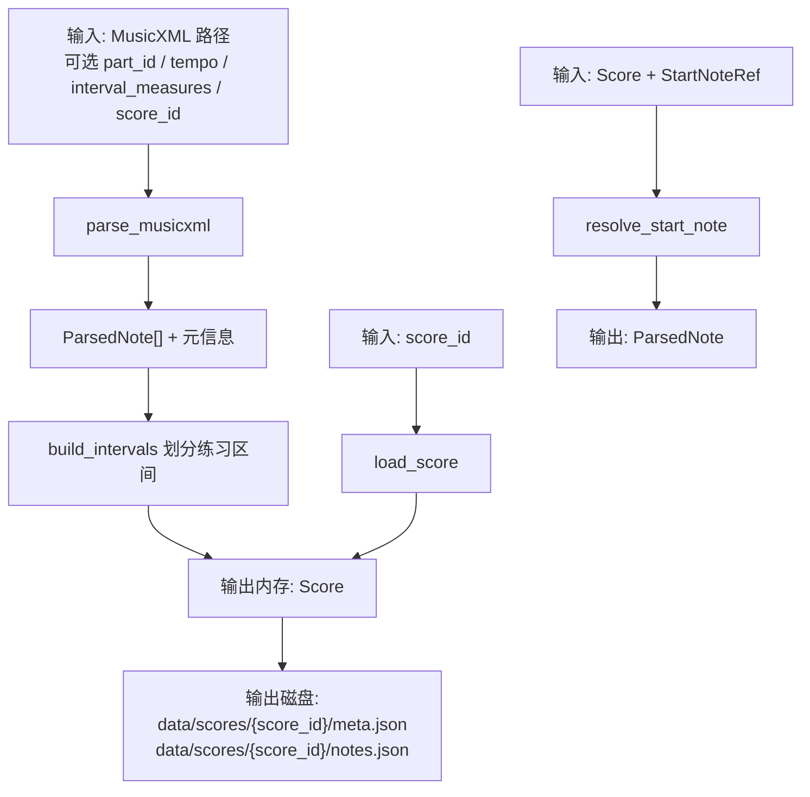
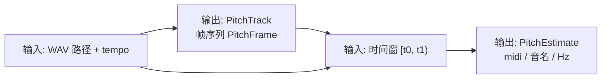
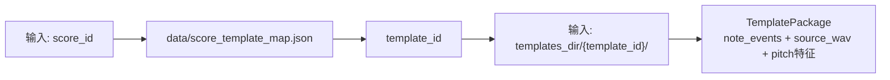
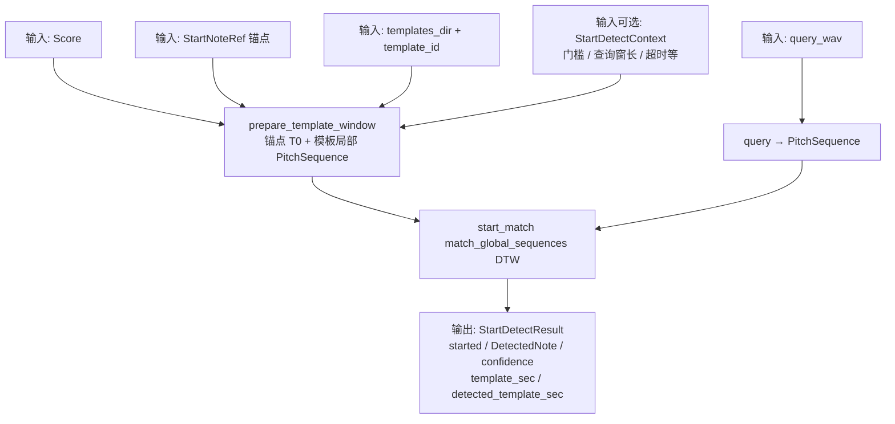
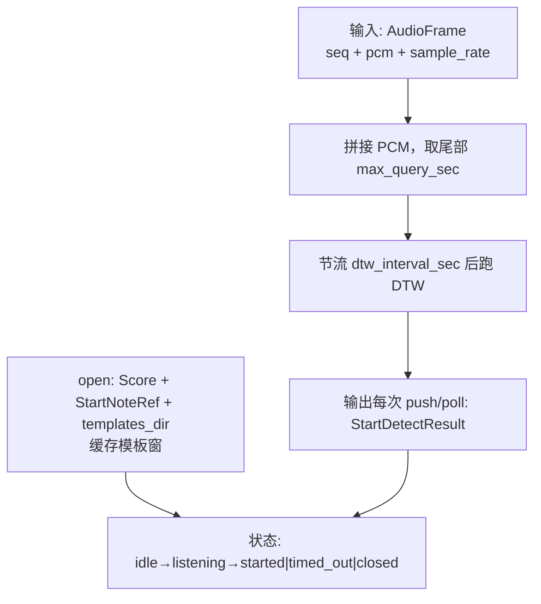
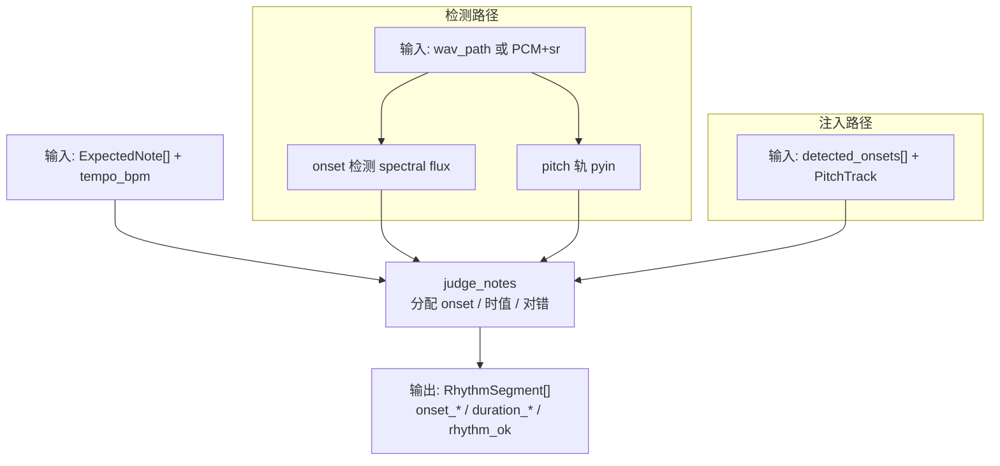
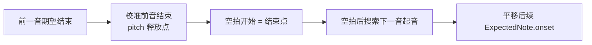
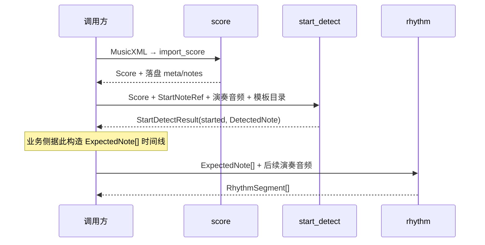

# 项目分析：数据流与输入输出

`music-practice` 是 **MusicXML 单声部跟谱** Python 库（无 HTTP 服务）。

**解耦**：MusicXML 转换与音频识别通过固定契约 `ScoreData` 通信（见 [SCORE_INTERFACE.md](SCORE_INTERFACE.md)），可单独工作。识别统一入口：`music_practice.recognize.recognize`。兼容入口：`from music_practice import utils`。

本文以**数据流**为主，标明各模块的**输入 / 输出**。开始点识别依赖本包 `music_practice.start_match`（原 music2seq）。

---

## 0. 转换 ↔ 识别契约



| 函数 | 输入 | 输出 |
|------|------|------|
| `score.convert_musicxml` | MusicXML 路径 | `ScoreData` |
| `recognize.recognize` | `ScoreData` + 音频 + `start_from`/`config` | `RecognizeResult` |

---

## 1. 总览



| 能力 | 典型输入 | 典型输出 | 是否落盘 |
|------|----------|----------|----------|
| 谱面 | MusicXML | `Score` | 是：`data/scores/{score_id}/` |
| 音高 | WAV / 时间窗 | `PitchTrack` / `PitchEstimate` | 否 |
| 开始点 | `Score` + 锚点 + 演奏音频 + 模板 | `StartDetectResult` | 否 |
| 节奏 | `ExpectedNote[]` + 音频（或注入 onset+音高轨） | `RhythmSegment[]` | 否 |

---

## 2. 谱面 score

**公开入口**：`utils.import_score` / `parse_score` / `get_score` / `list_score_summaries` / `get_start_note`



**`Score` 主要字段**：`score_id`、`tempo`、`notes: ParsedNote[]`、`intervals: Interval[]`  
**`ParsedNote`**：音高、小节、拍、onset、时值、`interval_id` 等  
**`StartNoteRef`**：`measure` + `note_index_in_measure`（小节内 1-based）

CLI：`python scripts/import_score.py <musicxml> --score-id <id>` → 同上磁盘布局。

---

## 3. 音高 pitch

**公开入口**：`utils.analyze_pitch_track` / `analyze_pitch_segment` / `analyze_pitch_segment_from_track`



- 算法：mono 加载 → `librosa.pyin`（与 start_detect 的 start_match 音高特征**独立**）
- `tempo` 影响帧长配置（`PitchDetectConfig.for_tempo`）
- **不写磁盘**

---

## 4. 开始点 start_detect

**公开入口**：`utils.detect_start_note`、`utils.StartDetectSession` + `AudioFrame`  
**依赖**：`music_practice.start_match`（模板加载、音高序列、DTW 匹配）

### 4.1 映射与模板



映射示例见 [`data/score_template_map.json`](data/score_template_map.json)：`meili_flute` → `meili_flute_1_2` 等。

### 4.2 批处理：文件音频



**`started=True` 条件（同时满足）**：

1. 查询时长 ≥ `min_query_sec`
2. 匹配分 ≥ `score_threshold`（默认 0.35）
3. `|检测到的模板时刻 − T0|` ≤ `anchor_tolerance_sec`

### 4.3 流式：`StartDetectSession`



- **输入**：连续 PCM 帧（可缺包填零）
- **输出**：与批处理相同的 `StartDetectResult`；超时见 `timed_out`
- **不写磁盘**

---

## 5. 节奏 rhythm

**公开入口**：`utils.evaluate_rhythm_audio` / `evaluate_rhythm_from_track`  
（模块内还有 `RhythmSession` 流式推帧）



| 字段方向 | 含义 |
|----------|------|
| `ExpectedNote` | 期望 onset、时值、MIDI（或休止） |
| `RhythmSegment` | 单音判定结果；产品侧节奏通过通常看 `rhythm_ok` / 时值相关字段 |

**产品规则**：`rhythm_ok ⟺ duration_ok`；`onset_ok` 为诊断字段。快于四分音符：窗内 ≥1 帧音高匹配（默认 ±1 半音）即过。

### 5.1 时长窗模式 `duration_window_mode`

配置见 `RhythmJudgeConfig.duration_window_mode`：

| 模式 | 行为 |
|------|------|
| `detected_onset`（默认） | 时长窗钉在**分配到的检出起音峰**上 |
| `score_grid` | 时长窗钉在**谱面期望 onset**上；检出起音仅诊断 |
| **`anchored_grid`** | 以谱面期望时间为锚；窗为 `[期望−pre, 期望+时值+post]`（默认 pre=0.2 拍、post=0.35 拍）；若检出起音落在容差内，用作窗内参考，**不**整窗跟着错峰漂 |

长段跟谱时，`detected_onset` 易因峰漂移导致后段连锁失败；`anchored_grid` 把判定锚回谱面格子并留前后垫，适合模板全曲回归（见 winter 全曲窗结果）。

调用示例：

```python
from music_practice.rhythm.config import RhythmJudgeConfig
from music_practice.rhythm.pipeline import evaluate_rhythm

segs = evaluate_rhythm(
    expected_notes,
    tempo_bpm=60.0,
    wav_path="window.wav",
    judge_config=RhythmJudgeConfig(duration_window_mode="anchored_grid"),
)
```

### 5.2 期望时间轴（MusicXML → note_events）

开始点/节奏夹具的期望秒数来自内嵌 `music_practice.start_match` 的 `parse_musicxml`。交付包内解析器已含：

- **和弦同起音**：带 `<chord/>` 的音与主音共享 onset，不再被排成先后半拍
- **速度记号 offset**：`<metronome>` + `<offset>` 在偏移处生效（例如双纵线处改速，不提前吃掉整小节休止）

流式 `RhythmSession`：缓冲 PCM → 到下一期望音附近再全量判定 → `push` 可能返回单个已关闭音段，`flush` 返回剩余。

### 5.3 空拍前后双校准（rest re-anchor）

模块：`music_practice.rhythm.reanchor`（`apply_rest_reanchors`）。

在调用 `judge_notes` / `evaluate_rhythm*` **之前**，若相邻发音音之间存在足够长的谱面空拍（默认 ≥ 0.5 拍），可对期望时间线做分段校正：



| 步骤 | 输出 |
|------|------|
| 前音结束 | `prev_note_end_detected_sec` |
| 空拍起 | `rest_start_sec`（= 前音结束） |
| 新音起 | `detected_sec`；`shift_sec` 作用于该音及之后所有期望 onset |

特点：只扫已有 `PitchTrack` 帧，**不**重跑整曲 pyin；前音结束搜索硬上限为下一音期望起音之前，避免锁到后音。  
配置：`RestReanchorConfig`（`min_rest_beat`、搜索窗拍数、音高容差等）。详见 [CHANGELOG_RHYTHM.md](./CHANGELOG_RHYTHM.md)。

典型接入（在节奏判定前）：

```python
from music_practice.rhythm import RestReanchorConfig, apply_rest_reanchors
from music_practice.rhythm.pipeline import evaluate_rhythm_from_track

adjusted, events = apply_rest_reanchors(
    expected_notes, pitch_track, tempo_bpm=tempo,
    config=RestReanchorConfig(enabled=True),
)
segs = evaluate_rhythm_from_track(
    adjusted, detected_onsets, pitch_track, tempo_bpm=tempo, judge_config=judge_cfg,
)
```

---

## 6. 端到端业务串联（推荐调用顺序）

跟谱场景下，模块可按下面顺序衔接（库本身不强制状态机）：



音高模块可独立用于展示/调试，也可作为节奏注入路径的 `PitchTrack` 来源。

---

## 7. 配置与目录（输入侧静态资源）

| 路径 | 角色 |
|------|------|
| [`data/score_template_map.json`](data/score_template_map.json) | `score_id → template_id` |
| `data/scores/{score_id}/` | 导入谱面持久化 |
| `music_practice.start_match/` | 开始点匹配引擎（随 `[start]` / `[all]` 安装） |
| 调用方提供的 `templates_dir` | start_match 模板包（含 `meta.json`、`note_events.json`、源音频等） |
| `tests/fixtures/` | 自测夹具（布局镜像生产 scores/templates） |

---

## 8. 观察与调试输出

`utils.observe` / `format_observation` / `to_observable_dict` 把 `Score`、`PitchEstimate`、`StartDetectResult` 等转成可读结构，**不改变业务数据流**，仅便于日志与测试断言。

---

## 相关文档

- 安装与用法：[../README.md](../README.md)
- 自测用例：[TESTING.md](./TESTING.md)
- 节奏 / 谱面时间轴更新：[CHANGELOG_RHYTHM.md](./CHANGELOG_RHYTHM.md)
- 转换 ↔ 识别契约：[SCORE_INTERFACE.md](./SCORE_INTERFACE.md)
